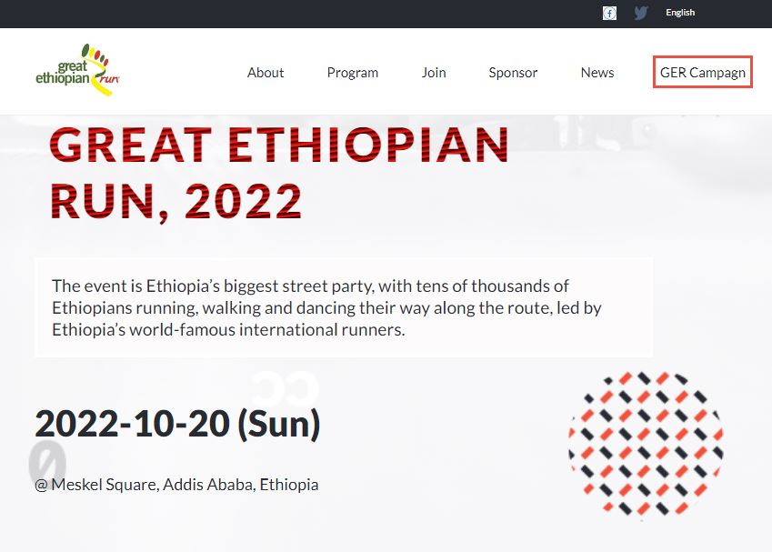

# Great Ethiopian Run 2022

## Description
This website is developed to promote the great ethiopian run that is going to be conducted on November 2022. The website has a nice look and feel on both small devices like phone and tablets and devices with large screens !!

### Screenshot of the desktop version 


### Screenshot of the mobile version


## Live Demo

- To see the website live, click [Live Demo Link](https://belmeetmule.github.io/Capstone/)

## Video about the project

- To watch a dem, click on [Video Link](https://www.loom.com/share/9f5129e9131746c28516a5299c49afee)

## Built With

- HTML
- CSS
- java script

## Technologies used: 
- linters
- Lighthouse
- Webhint
- Stylelint


## Getting Started


To get a local copy up and running follow these simple example steps.

### Prerequisites
- IDE(code editor) like: **Vscode**, **Sublime**, etc. 
- [Git](https://www.linode.com/docs/guides/how-to-install-git-on-linux-mac-and-windows/)

### Setup
1. Download the **Zip** file or clone the repo with:
```bash
git clone https://github.com/belmeetmule/portfolio.git
```
3. To access cloned directory run:
```bash
cd portfolio
```
3. Open it with the live server

### Install
> To install linters and other project's dependencies run:
```bash
npm install
```
## Run Test for Linters

For tracking linter errors locally you need to follow these steps:

1. For tracking linter errors in HTML files run:
```bash 
npx hint .
```

2. For tracking linter errors in CSS or SASS files run:

```bash
npx stylelint "\*_/_.{css,scss}"
```

## Authors

👤 **Mulugeta M.**

- GitHub: [@belmeetmule](https://github.com/belmeetmule)
- Twitter: [@belmeetmule](https://twitter.com/belmeetmule)
- LinkedIn: [belmeetmule](https://linkedin.com/in/belmeetmule)


## 🤝 Contributing

Contributions, issues, and feature requests are welcome!

Feel free to check the [issues page](https://github.com/belmeetmule/portfolio/issues).

## Show your support

Give a ⭐️ if you like this project!

## Acknowledgments

- Thank You [Cindy Shin](https://www.behance.net/adagio07) for the template of this project.
- Thank You [Microverse](www.microverse.org) team and the reviewers for all the supports.
- Thanks to everyone who will get time to check this code and suggest any [issues](https://github.com/belmeetmule/hello-world/issues)

## 📝 License

This project is [MIT](./MIT.md) licensed.
